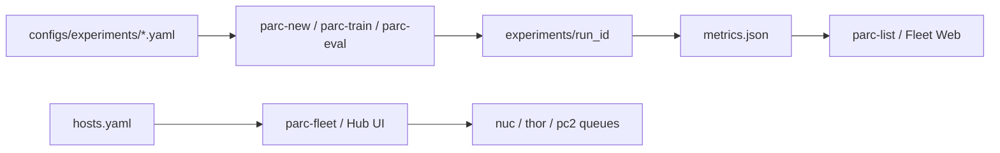

# 00. 全体像

> **初めての方:** 用語と初回実行は [catchup/](../catchup/)（[README](../catchup/README.md) → 概念 → 学習 URL → first run）から始めてください。

## 何を作っているか

PARC2026 はシミュレーション上で VLA（Vision-Language-Action）を鍛え、  
**LIBERO / LIBERO-Plus** の摂動タスクで汎化を競うコンペです（説明会資料より）。

ルール未公開の今は、次を先に完成させます。

1. **評価パイプライン**が毎回同じ手順で回る  
2. **実験が run_id で追跡**できる  
3. **学習レシピ**を YAML で差し替えられる  

本選で Pi0 / Gr00t 等が配られたら、同じ評価・実験管理のまま学習バックエンドだけ差し替えます。

## 用語

| 用語 | 意味 |
|------|------|
| suite | `libero_spatial` / `object` / `goal` / `libero_10` など |
| task_id | suite 内の 0-based インデックス（classification の id は 1-based） |
| trial | 同一タスクの繰り返し。LIBERO-plus 公式は **1** |
| category | カメラ・初期姿勢・言語・光・背景・ノイズ・レイアウトの 7 摂動 |
| run | `experiments/<run_id>/` に設定・ログ・metrics を保存した 1 実験 |

## 推奨ワークフロー

```text
setup_env → smoke → (データ取得 / 自前変換) → train → eval_ckpt → list / 比較 → 改善
```

独自データや学習レシピの変え方は [07_custom_data_and_algos.md](07_custom_data_and_algos.md)。  
別 PC からの Web / Jupyter は [08_remote_and_ui.md](08_remote_and_ui.md)。  
**複数 PC / Fleet 横断**は [11_multi_machine.md](11_multi_machine.md)
（git 共有・ローカルデータ・machine_id・GDrive・`parc-remote` / `parc-fleet`）。  
**Quest 3 VR デモ収集**は [12_vr_teleop.md](12_vr_teleop.md)（設計・進捗は [feature/vr-teleop/](../feature/vr-teleop/)）。



## ディスク注意

このマシンはルート・`/mnt/sda` とも空きが少ないです。  
大きいデータ・チェックポイントは `configs/paths.yaml` で外付けパスへ逃がしてください（例は `paths.example.yaml`）。  
`paths.yaml` はマシン固有のため **git に含めません**。

無人で回す場合は **予算付きキュー**を使います（詳細は [09_autoloop_and_rl.md](09_autoloop_and_rl.md)）。

```text
parc-enqueue --sweep ...  →  parc-worker --loop  →  parc-prune
```

`disk.max_bytes_gb` / `keep_best` / `keep_last` を超えた実験は自動削除されます。
